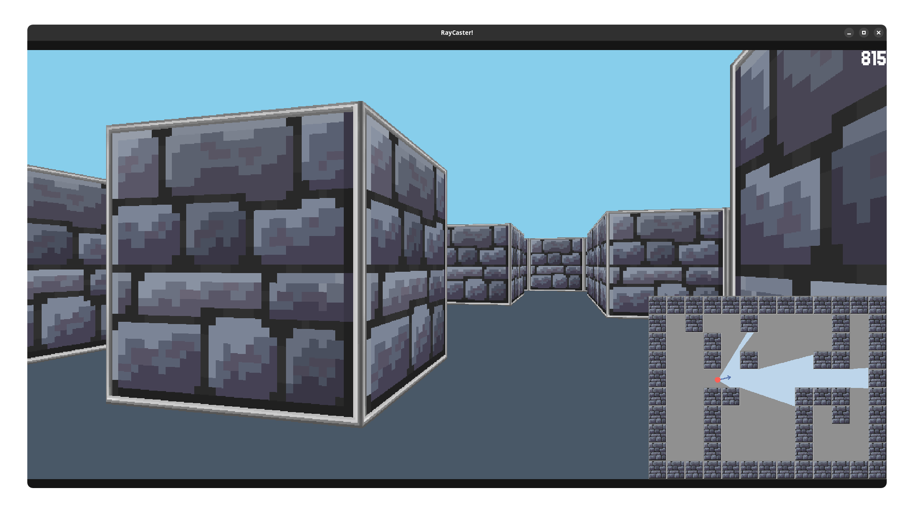
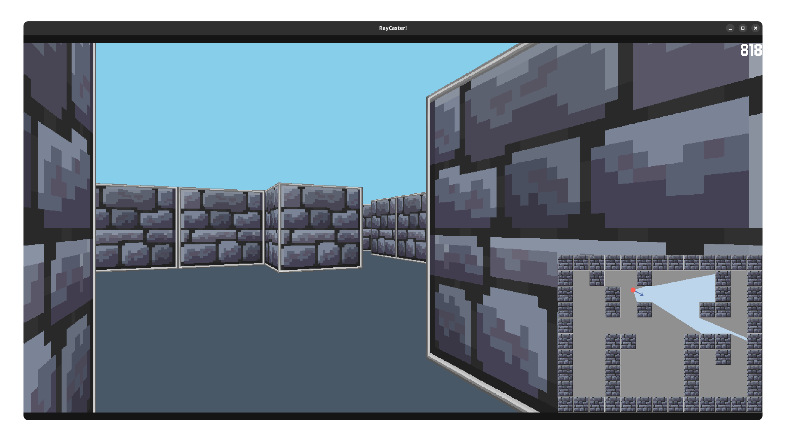

# Ray Caster

A simple, but fun ray casting engine written in C++ and SFML 2.6.
It uses similar display technique to Wolfenstein 3D (1992) - for each horizontal pixel it casts a ray
and the shorter the ray, the longer the texture drawn on the screen.

Controls are simple - WASD to move, RIGHT and LEFT arrow to rotate.




Build it yourself:

1. Install dependencies:
    * Arch Linux:
       ```shell
       sudo pacman -S cmake sfml nlohmann-json
       ``` 
    * Debian / Ubuntu:
      ```shell
      sudo apt-get install cmake libsfml-dev nlohmann-json3-dev
      ```

2. Build project and run:

```shell
bash -c "git clone https://github.com/matihope/RayCaster.git && \
    cd RayCaster && \
    cmake -B build && \
    cd build && \
    make && \
    ./RayCaster"
```

List of attributions:

* [SFML](https://github.com/SFML/SFML)
* [nlohmann json](https://github.com/nlohmann/json)
* [Castle_Wall.png and Black_Brick.png - Pixel World Wiki](https://pixelworlds.fandom.com/wiki/Castle_Wall)
* Born2bSportyV2 font. Unluckily, I can't find it anywhere on the internet anymore. 
